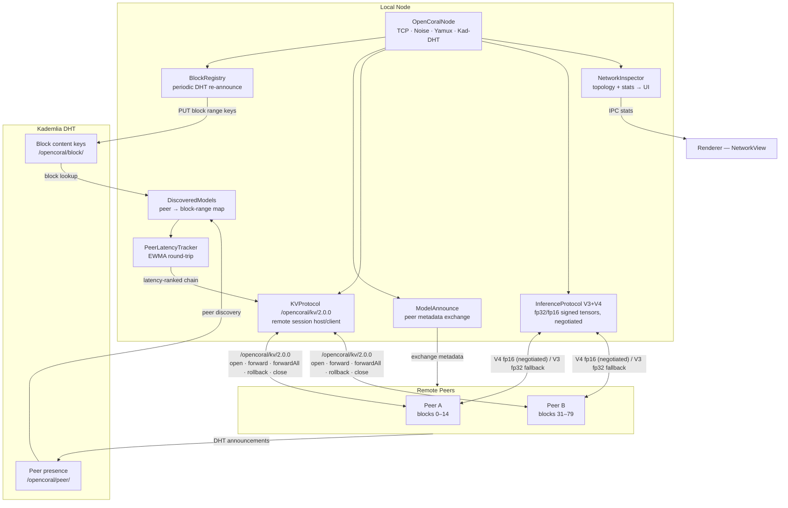

# Architecture

OpenCoral splits transformer inference across peers. Each instance loads a slice of a model, serves those blocks to the network, and can use remote peers to complete its own inference chain — all without centralized infrastructure.

## Design Rationale

| Choice | Why |
|---|---|
| Electron + Bun | Single installer, no Python/conda dependency chain |
| GGUF / llama.cpp | Wide hardware support (CUDA, ROCm, Metal, CPU) with quantization built-in |
| js-libp2p + Kademlia DHT | Standards-based peer discovery and encrypted tensor relay |
| n-gram speculative decoding | Cheap draft tokens reduce latency, especially on remote-heavy chains |
| Ed25519 signed tensors | Tamper detection on forwarded hidden states, no blockchain required |

## Subsystems

### Main Process (`src/main/`)

IPC entry point, model loading, chat session lifecycle, and HuggingFace integration. Delegates computation to the Inference layer and networking to the P2P layer.

| File | Role |
|---|---|
| `index.ts` | IPC entry point and process lifecycle |
| `block-host.ts` | Loads the local model slice, drives inference; owns the persistent `SequenceManager` (P2-5 routing-refresh) |
| `inference-orchestrator.ts` | Single-prompt runner: tokenize → speculative generate → result |
| `chat-session-manager.ts` | Manages active sessions: KV open, prefill, decode loop, resume. Wraps `KVChain` in `PipelinedKVChain(depth=2)` for distributed sessions (P2-12). Invalidates active context on hosting change so a stale plan can't outlive its host. |
| `chat-session-ipc.ts` | IPC wiring; keeps Electron imports out of the manager core |
| `session-store.ts` | Persists chat sessions as JSON with a debounced write index |
| `kv-session-registry.ts` | Tracks open KV sessions for remote peers (serve side) |
| `model-manager.ts` | GGUF file parsing and metadata cache |
| `huggingface.ts` | Search, download, and partial-fetch from HuggingFace |
| `identity.ts` | Persistent Ed25519 key pair |

### Inference (`src/inference/`)

Pure compute layer — no I/O, no networking. Runs in a worker thread to keep the main process responsive.

| File | Role |
|---|---|
| `native-worker.ts` | Worker-thread wrapper; all GPU calls go through here |
| `speculative-session.ts` | n-gram draft + verification loop (speculative decoding); MARS margin-aware accept (P2-11), PEARL adaptive draft length (P2-10), SpecPipe predict-and-pre-submit when `pipelineDepth=2` (P2-12) |
| `ngram-cache.ts` | Rolling n-gram table for cheap draft prediction |
| `sequence-manager.ts` | Plans the block chain: local steps + remote peer steps |
| `block-runner.ts` | Executes a local transformer block range |
| `embedder.ts` | Token embedding projection |
| `native-tokenizer.ts` | BPE / SentencePiece tokenizer with chat template support |
| `coverage.ts` | Checks whether the network covers all required blocks |
| `pipeline-scheduler.ts` | Splits hidden states into micro-batches for chunked forwarding |
| `sampler.ts` | Temperature + top-k sampling |

### P2P (`src/p2p/`)

Peer discovery, block registration, and remote tensor forwarding over libp2p.

| File | Role |
|---|---|
| `node.ts` | libp2p node: TCP + Noise + Yamux + Kademlia DHT |
| `dht.ts` | Peer presence and per-block content routing |
| `block-registry.ts` | Periodically re-announces the local block range to the DHT |
| `kv-protocol.ts` | Remote KV-cache session protocol `/opencoral/kv/2.0.0` (open / forward / forwardAll / rollback / close); per-stream FIFO at the peer |
| `kv-chain.ts` | Chains multiple `KVSessionClient`s sequentially into a single `VerificationBackend`; compensating rollback on partial-chain failure |
| `pipelined-kv-chain.ts` | P=2 optimistic SpecPipe wrapper over `KVChain` — per-hop tail promises let step N+1 occupy hop 0 while step N is at hop 1+ (P2-12) |
| `inference-protocol.ts` | Signed tensor forwarding; V3 (`/opencoral/inference/3.0.0`, fp32) + V4 (`/opencoral/inference/4.0.0`, fp16 — P2-1) negotiated via libp2p multistream-select; initiator-side phase profiling (sign / send / wait / verify) for P2-9 |
| `model-announce.ts` | Peer metadata and block-range exchange |
| `discovered-models.ts` | Tracks known remote peers and their block ranges |
| `peer-latency.ts` | EWMA round-trip latency per peer |
| `network-inspector.ts` | Topology and stats for the UI |

### Renderer (`src/renderer/`)

React UI in the Electron renderer process. Communicates with the main process exclusively through the preload IPC bridge.

| Directory | Role |
|---|---|
| `components/Chat/` | Chat panel: message list, input, streaming display |
| `components/Model/` | Model browser, download progress, selector |
| `components/Network/` | Network view: peer map, block coverage |
| `components/Block/` | Block-range tags and coverage status |
| `components/Toast/` | Toast notifications |
| `components/shared/` | Shared UI primitives |

### Preload (`src/preload/`)

The contextBridge layer. Exposes a typed `window.opencoral.*` API to the renderer. No logic lives here.

## Diagrams

### Distributed Inference Flow

```mermaid
sequenceDiagram
    participant User
    participant Chat as ChatPanel (Renderer)
    participant IPC as ChatSessionIPC
    participant Mgr as ChatSessionManager
    participant SM as SequenceManager
    participant PKVC as PipelinedKVChain
    participant KVC as KVChain
    participant Spec as SpeculativeSession
    participant NGC as NgramCache
    participant KVP as KVProtocol
    participant Peers as Remote Peers

    User->>Chat: Send message
    Chat->>IPC: opencoral:send-turn
    IPC->>Mgr: openTurn(sessionId, text)

    Mgr->>SM: getCachedChain() ?? plan() → local + remote steps
    SM-->>Mgr: chain plan

    Mgr->>KVP: openRemoteSession() per remote peer
    KVP->>Peers: /opencoral/kv/2.0.0 open
    Peers-->>KVP: session ack

    Mgr->>KVC: new KVChain(embedder, KVSessionClients)
    Mgr->>PKVC: wrap KVChain in PipelinedKVChain(depth=2)
    Mgr->>Spec: new SpeculativeSession(PipelinedKVChain backend, pipelineDepth=2)

    rect rgb(30, 60, 100)
        Note over Mgr,Peers: Prefill — full prompt context
        Spec->>PKVC: forwardAll(promptIds)
        PKVC->>KVC: forwardAll (depth=1 passthrough on first call)
        KVC->>KVC: embed tokens locally
        loop each remote KVSessionClient (per-hop FIFO)
            KVC->>Peers: forward hidden state chunk
            Peers-->>KVC: updated hidden state
        end
        KVC-->>Spec: logits
    end

    rect rgb(30, 80, 50)
        Note over Mgr,Peers: Decode — speculative batches with SpecPipe overlap
        loop until EOS or maxTokens
            Spec->>NGC: lookup drafts for [allTokens]
            NGC-->>Spec: draft sequence
            Spec->>PKVC: forwardAll([nextToken, ...drafts]) for current step
            Note over Spec,PKVC: predict bonus via ngram — pre-submit next step BEFORE awaiting current
            Spec->>PKVC: forwardAll([predictedBonus, ...predicted drafts]) for next step
            par chain pipelining
                PKVC->>Peers: current step traverses hop 0 to hop 3
            and
                PKVC->>Peers: next step enters hop 0 once current clears it
            end
            PKVC-->>Spec: current step logits, then next step logits
            Spec->>Spec: MARS accept or reject, then sample bonus token
            Spec->>Spec: reuse pending on prediction match, else discard and rollback
        end
    end

    Mgr->>KVP: closeRemoteSession() per peer
    Mgr-->>IPC: TurnResult
    IPC-->>Chat: result + trace
    Chat-->>User: Display response
```

### P2P Data Flow

