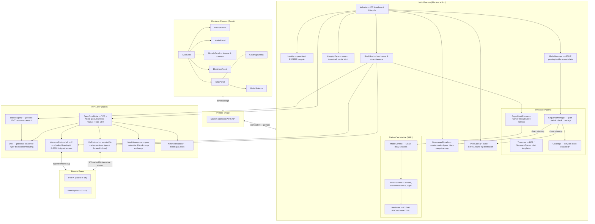
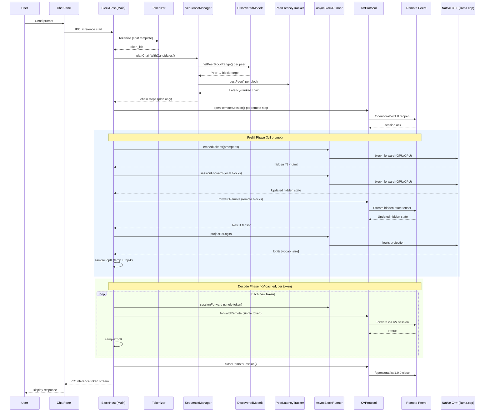

# OpenCoral — Decentralized LLM Desktop Client

OpenCoral is an open-source attempt to build a **decentralized large language model network** as a modern desktop application. Inspired by [Petals](https://github.com/bigscience-workshop/petals), it splits transformer blocks across many machines and chains inference requests through them — but rebuilds the concept from scratch using a contemporary **TypeScript/Bun/Electron** stack, **GGUF** model format via [node-llama-cpp](https://github.com/withcatai/node-llama-cpp), and **js-libp2p** for peer-to-peer networking.

Every running instance is both a **client and a node**: it loads a slice of a large model (e.g. Llama 3.1 70B), serves those blocks to other peers, and earns tokens that pay for its own inference usage. The result is a Goose-style agentic desktop client where users can chat, run tools, and contribute compute — all without centralized GPU infrastructure.

## Key Design Choices

- **Electron + Bun** — single installer, no Python/conda dependency chain
- **llama.cpp (GGUF)** — wide hardware support (CUDA, ROCm, Metal, CPU), efficient quantization (Q4–Q8)
- **js-libp2p (Kademlia DHT)** — standards-based peer discovery, gossip, and encrypted activation-tensor relay
- **Token economy via signed receipts** — nodes earn and spend tokens locally without blockchain or wallet setup
- **Agentic UI** — built-in tools (file I/O, shell, web search) with KV cache kept alive across tool calls

## Supported Models

Any GGUF model on HuggingFace that llama.cpp supports. Initial targets: **Llama 3.1 70B/405B**, **Mixtral 8x22B**, **Qwen 2.5 72B**, and **Gemma 3 27B**.

## Hardware

| Hardware | Support |
|----------|---------|
| NVIDIA GPU (CUDA) | Full — highest throughput and token earnings |
| AMD GPU (ROCm) | Full via llama.cpp ROCm backend |
| Apple Silicon (Metal) | Full via llama.cpp Metal backend |
| CPU only | Supported — fewer blocks, lower throughput weight |

Minimum: 8 GB RAM (CPU) or 8 GB VRAM (GPU).

## Architecture

### Distributed Inference Flow

## Status

Early development — this is an experimental rebuild, not a production system.
